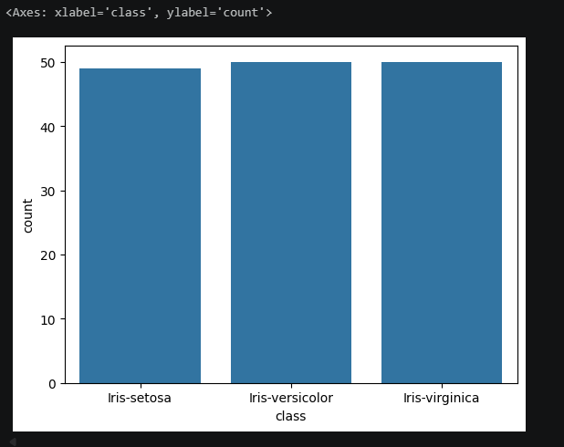
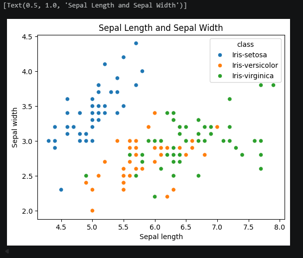
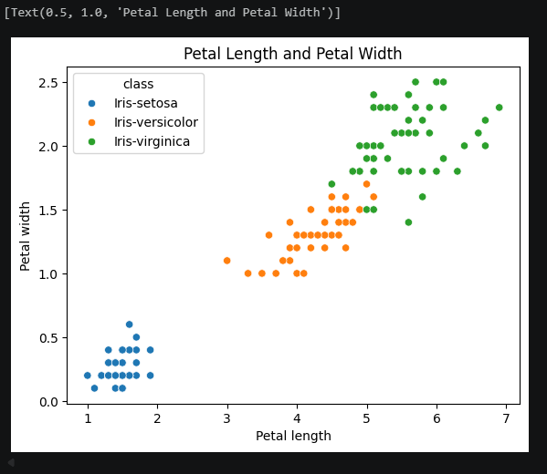
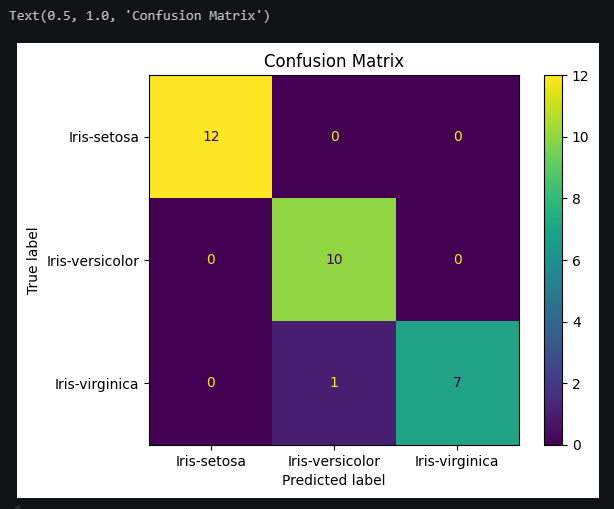
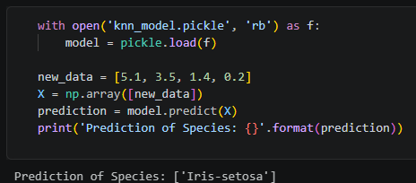

# Iris Flower Classification

After classifying fruits, I had to classify iris flowers now :D

This was a supervised machine learning project from 2025 that classifies iris flowers into three species based on petal and sepal measurements. 

## Overview

The program uses the classic Iris dataset to train a K-Nearest Neighbors (KNN) classifier. After training, the model can predict the species of a new flower given its measurements. The trained model is saved to disk using `pickle` so it can be loaded without retraining.

## Concepts Learned

In this project, I got to learn more things than the previous ml project.

- What supervised machine learning is
- Add data, then train, then evaluate, then predict
- Loading datasets with `pandas` and `seaborn`
- Data visualization with `seaborn` pairplots
- Train/test split with `sklearn`
- K-Nearest Neighbors classifier
- Model accuracy evaluation
- Saving and loading models with `pickle`

## Screenshots / Output







## Setup

```
pip install scikit-learn pandas seaborn numpy
```


